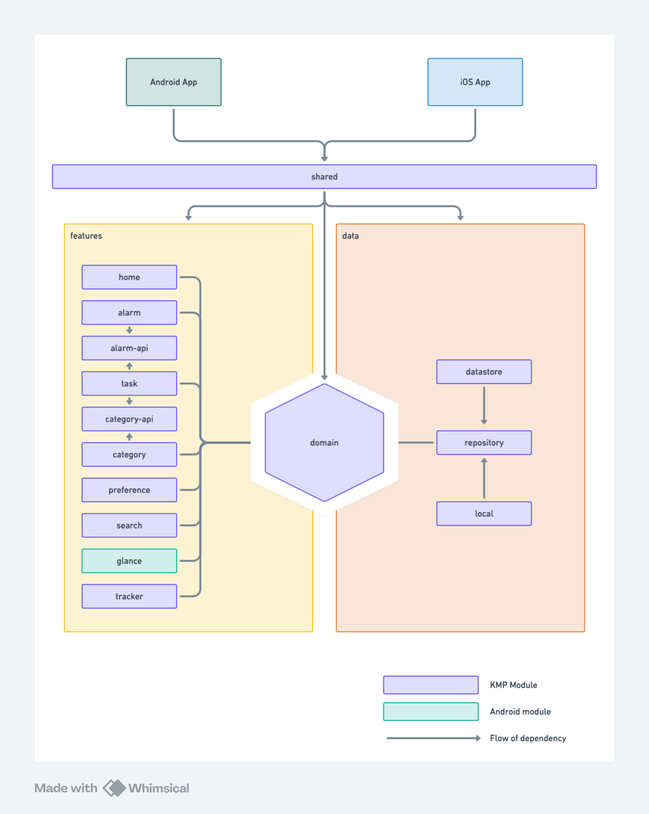

[](https://github.com/igorescodro/alkaa/actions/workflows/instrumented_tests.yml)
[](https://codebeat.co/projects/github-com-igorescodro-alkaa-main)
[](https://www.codefactor.io/repository/github/igorescodro/alkaa/overview/main)
[](https://www.codacy.com/manual/igorescodro/alkaa?utm_source=github.com&amp;utm_medium=referral&amp;utm_content=igorescodro/alkaa&amp;utm_campaign=Badge_Grade)
<a href="https://ktlint.github.io/"></a>


# Alkaa 3.0 - Multiplatform

Alkaa (_begin_, _start_ in Finnish) is a to-do application project to study the latest components,
architecture and tools for Android development. The project evolved a lot since the beginning is
available on Google Play and App Store! ❤️

The current version of Alkaa was completely migrate to **Kotlin and Compose Multiplatform**!

## Android
|   |  |   |  |
| ------------- | ------------- | ------------- | ------------- |

## iOS
|  |   |  |  |
| ------------- | ------------- | ------------- | ------------- |

## 📦 Download


<table style="width:100%">
  <tr>
    <td><a href='https://play.google.com/store/apps/details?id=com.escodro.alkaa'></a>
    <td><a href='https://apps.apple.com/ca/app/alkaa/id6476208968'></a>
  </tr>
</table>


## 📚 Tech stack

One of the main goals of Alkaa is too use all the latest libraries and tools available.

### 🧑🏻‍💻 Multiplatform development

- Application entirely written in [Kotlin](https://kotlinlang.org)
- UI developed in [Compose Multiplatform](https://www.jetbrains.com/lp/compose-multiplatform/)
- UI Tests with [Compose Multiplatform UI Testing](https://www.jetbrains.com/help/kotlin-multiplatform-dev/compose-test.html)
- Following the [Material You](https://m3.material.io/) guidelines and dynamic color (Android only)
- Asynchronous processing using [Coroutines](https://kotlin.github.io/kotlinx.coroutines/)
- Widgets using [Jetpack Glance](https://developer.android.com/jetpack/androidx/releases/glance)
- Dependency injection with [Koin](https://insert-koin.io)
- Database using [SQLDelight](https://github.com/cashapp/sqldelight)

For more dependencies used in project, please access the
[Dependency File](https://github.com/igorescodro/alkaa/blob/main/gradle/libs.versions.toml)

If you want to check the previous version of Alkaa, please take a look at
the latest [V1](https://github.com/igorescodro/alkaa/tree/v1.7.0) or [V2](https://github.com/igorescodro/alkaa/tree/v2.3.0) releases.

### 🧪 Quality

- [klint](https://github.com/shyiko/ktlint)
- [detekt](https://github.com/arturbosch/detekt)
- [compose-rules](https://github.com/twitter/compose-rules)
- [lint](https://developer.android.com/studio/write/lint)
- [codebeat](https://codebeat.co)
- [CodeFactor](https://www.codefactor.io/)
- [Codacy](http://codacy.com)

## 🏛 Architecture

Alkaa architecture is strongly based on
the [Hexagonal Architecture](https://alistair.cockburn.us/hexagonal-architecture/) by Alistair
Cockburn. The application also relies heavily in modularization for better separation of concerns
and encapsulation.

Let's take a look in each major module of the application:

* **app** and **ios-app** - The platform-specific app module. It contains all the initialization logic for each platform.
* **features** - The module/folder containing all the features (visual or not) from the application
* **domain** - The modules containing the most important part of the application: the business
  logic. This module depends only on itself and all interaction it does is via _dependency
  inversion_.
* **data** - The module containing the data (local, remote, light etc) from the app.
* **libraries** - The module with useful small libraries for the project, such as design system,
* navigation, test etc.

This type of architecture protects the most important modules in the app. To achieve this, all the
dependency points to the center, and the modules are organized in a way that
_the more the module is in the center, more important it is_.

To better represents the idea behind the modules, here is a architecture image representing the flow
of dependency:



## 📃 License

```
Copyright 2018 Igor Escodro

Licensed under the Apache License, Version 2.0 (the "License");
you may not use this file except in compliance with the License.
You may obtain a copy of the License at

    http://www.apache.org/licenses/LICENSE-2.0

Unless required by applicable law or agreed to in writing, software
distributed under the License is distributed on an "AS IS" BASIS,
WITHOUT WARRANTIES OR CONDITIONS OF ANY KIND, either express or implied.
See the License for the specific language governing permissions and
limitations under the License.
```
