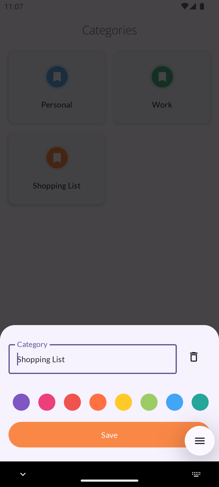
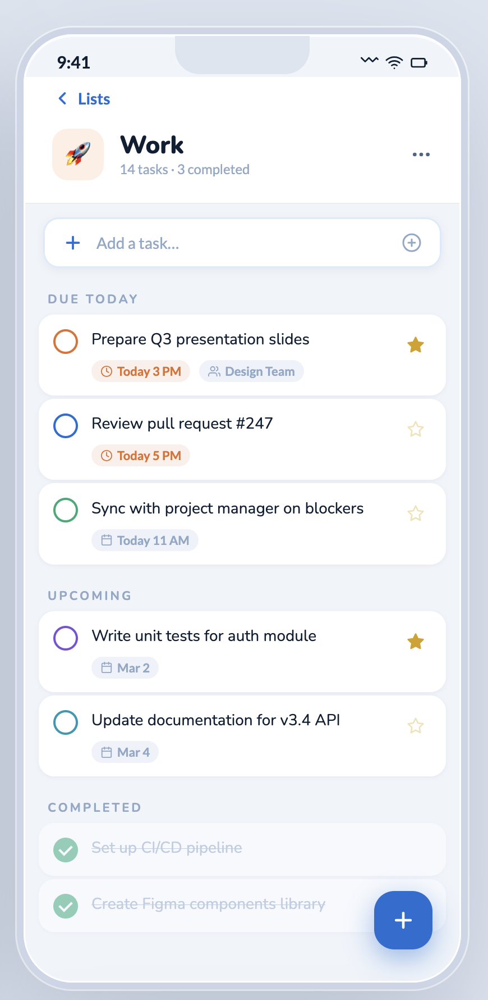

# 🐈 Category details

## Overview

Alkaa is being revamped to a new user interface, following the Kuvio design system. The first screen
selected to be implemented is the Category details screen. This is a new screen in the app, since
the category details today is a simple Bottom Sheet where the user can simply update the category
name and color or delete it entirely, removing all the categories in the process.

The new screen for the Category details is going to be a full screen showing a header with more
information, all the tasks associated with this category, a separation by task state, and more.

## Screen details

The screen consists of the following components:

- **Header** - contains the back button, and a header with the information:
    - Emoji icon related to the category - e.g. "🚀"
    - Name of the category - e.g. "Work"
    - Current progress - "14 tasks - 3 completed"
    - Vertical three dots icon for options. Available options:
        - Rename
        - Delete
- **List of tasks** - contains the list of all tasks, separate by state. If a state does not have
  tasks, the state is now shown in the UI
    - States:
        - Due today - tasks that have the due date equal today
        - Upcoming - tasks that have the due date to a date in the future
        - No due date - tasks without due date
        - Completed - tasks completed
- **Add task bar** - the Kuvio component for adding a Task, floating at the bottom of the screen

## Current integration

This screen will be integrated in the "OnCategoryClick" event, controlled by the IsNewDesignEnabled
feature flag. When enabled, it will redirect to the new screen, otherwise it will keep forwarding
to the bottom sheet.

Components such as "add task bar" and the "task item" already exist in the Kuvio Design System. For
new complex components, such as the "header", a new component will be created on the design system
module.

## Out of scope

The following tasks are currently out of scope:

- Emojis are not yet supported in the category object. For now, we are simply showing a placeholder
- When clicking on the "Available options" ("Rename" and "Delete") no action will be taken yet.

## Acceptance criteria

All the acceptance criteria below assume that the IsNewDesignEnabled is turned on, meaning that
the feature is available

- Given the user navigates to the "Categories tab"
- When they click on an existing category
- Then the new screen is shown

---

- Given the user has several tasks
- When the Category Details screen is opened
- All categories will be shown in their respective states

---

- Given the user has no tasks
- When the Category Details is opened
- Information will be shown in the content area that no tasks were added yet

---

- Given the user is in the Category Details screen
- When they add a new task
- The task will be shown in the list

---

- Given the user is in the Category Details screen
- When they add a new task with a due date
- The task will be shown in the list, in the correct section

## Important

1. For changing the codebase, the skills inside  must be used. They have
   all the information on how to deal with implementing a feature, navigation, compose, testing,
   etc.

2. The proposed code needs to follow the correct architecture as closely as possible

3. Each commit needs to be concise.

4. At the end of the work, all tests and quality checks are passing 
